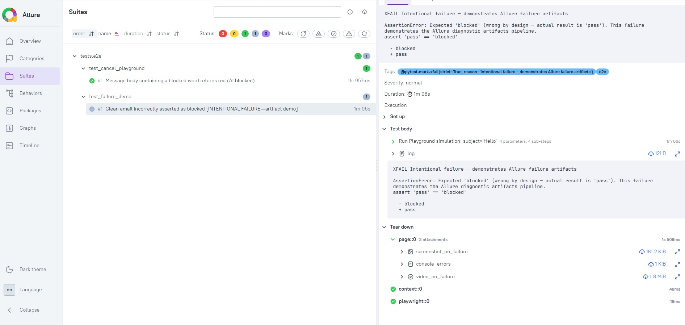

# Design Rationale

## Language and Framework

Python + Playwright + pytest.

Python because test code gets read by people who aren't QA engineers. Developers review tests too, and Python reads close enough to plain English that the intent is clear without knowing the framework. pytest's fixture system handles teardown logic cleanly, which matters here because cleanup is load-bearing (more on that below).

Playwright because of auto-wait. Playwright waits for elements to be actionable before every interaction — that removes an entire class of flakiness at the framework level rather than requiring explicit waits per test.

---

## Auth Strategy

Google OAuth (Descope) can't be automated — it's designed to resist it. Three strategies, applied in order of availability:

1. **Saved session** (`auth/auth.json`) — zero friction for local dev. Run once, save tokens, reuse forever.
2. **Token injection via env vars** (`NOTCH_DS_TOKEN` / `NOTCH_DSR_TOKEN`) — CI-safe. Extract cookies from DevTools after a manual login, inject at pipeline runtime. No browser interaction needed.
3. **Interactive fallback** — opens a real Chrome window, waits 5 minutes for manual login, saves the session. Runs once, then strategy 1 takes over.

The `ensure_auth` fixture is session-scoped — auth happens once per suite run, not once per test.

One non-obvious issue on Windows: persistent context cookies are encrypted in the Chrome profile and `storage_state()` returns them empty. The workaround is reading cookies directly from the live page context rather than from the saved state file.

---

## Selector Strategy

All selectors anchor on visible text or ARIA roles. Never on CSS class names — they're generated hashes that change on every rebuild and break silently.

Notch-specific findings from DOM exploration:

- Section headings are plain `div`/`p` elements — not semantic `h1-h6`. `get_by_role("heading")` finds nothing; `get_by_text()` works.
- The keyword input is a hidden `<textarea>` that overlays a placeholder div. `get_by_role("textbox")` locates it correctly.
- Chip text content includes the "×" close element as a child node, so `get_by_text(value, exact=True)` misses chips. `exact=False` is required.
- The Automation Audit section sits at the bottom of a long page. `scroll_into_view_if_needed()` is called before interacting with any section — without it, clicks land on the wrong element or miss entirely.

---

## Test Isolation

The test adds a config rule, runs the Playground, then removes the rule in teardown — whether the test passed or failed.

This matters more than it might seem. The Automation Audit config is persistent and shared. If a test fails mid-run and leaves "cancel" in the blocklist, every future run inherits that state, and anyone using the dashboard manually sees a rule they didn't add. The `cleanup_blocked_word` fixture handles teardown with a `yield` — equivalent to `finally` — so the cleanup runs regardless of test outcome.

One non-obvious ordering: `cleanup_blocked_word(SECTION, BLOCKED_WORD)` is called at the start of the test body, before `add_entry`. This registers the cleanup for teardown immediately — so even if the test fails during navigation, before the rule is ever added, the cleanup is already scheduled. This is defensive: it costs nothing on the happy path and prevents stray registrations on early failure.

Each test also gets a fresh browser context from the `page` fixture. No test-to-test state bleeds — each context is fresh except for the intentionally injected auth session.

---

## Save Before Playground

The config UI operates in draft mode. Adding a keyword to a section updates the UI but does not push the rule to the AI pipeline until you explicitly save.

The test calls `save()` after adding the rule, before navigating to the Playground. Skipping this step produces a false negative: the Playground returns "allowed" not because the rule doesn't work, but because it was never persisted. This is the kind of silent failure that would waste debugging time.

---

## Reporting and Triage

Every failed test automatically captures: screenshot, video, Playwright trace (DOM snapshots, network, console), and JS console errors — all attached to the Allure report. Tracing and video run for every test but are discarded on pass, keeping CI storage clean.

`@allure.step` is applied to `navigate_to()` on `BasePage` — every page navigation appears as a named step in the Allure timeline.

`test_failure_demo.py` is a deliberately wrong assertion marked `@pytest.mark.xfail(strict=True)`. The test expects to fail; pytest records it as `XFAIL` and CI stays green. The point: the diagnostics pipeline runs on every push, so failure artifacts are always visible in the report — no waiting for a real bug to verify they work.

---

## What I Would Do Next

**More sections covered.** The current implementation covers "Words in User Message." The same infrastructure handles all four sections — "Emails patterns to unassign," "Subjects," "Words in Assistant's Reply" — so adding tests is a matter of parameterization, not new plumbing.

**Suite tiering.** Not every test should run on every push. The right split: smoke on PR (fast gate), full regression nightly. One flaky network timeout in a non-critical test shouldn't block a deploy.

**Both directions of every rule.** The suite only covers the blocking case. Both directions matter: a configured keyword should always block — if it doesn't, that's a product failure. An unrelated message should never block — if it does, the AI is incorrectly refusing to respond. For an autonomous agent, false negatives and false positives are equally dangerous.

**Conflict detection.** What happens if the same keyword appears in both "Words in User Message" and "Words in Assistant's Reply"? Or if a sender email matches the pattern but another rule has a whitelist override? These edge cases are likely untested and are exactly where an AI agent will make a surprising decision.

**Reply (outbound) tests.** "Words in Assistant's Reply" is the only outbound rule — it operates on the AI's draft, not the inbound email. The Playground should support simulating this, but it requires understanding how the reply field interacts with the config. Worth verifying manually before automating.

**CI auth rotation.** The current CI strategy uses a base64-encoded session token as a GitHub secret. Session tokens expire. The right long-term solution is a service account with a stable token or a programmatic auth flow that bypasses OAuth. Until that exists, someone needs to rotate the secret manually when tests start failing with 401s.

---

## Process Notes

I designed the structure first — page objects, fixture model, teardown strategy, selector approach. Once the skeleton was in place, I used Claude to implement inside it. The structure was the constraint. That's how I stayed in control of what came out.

Claude was my main tool. When I wasn't sure about something it produced, I cross-checked with GPT — using one AI to check another.

The architectural decisions were mine, and I made each one for a reason: the layer separation between tests, page objects, and flows so that adding coverage for a new section is parameterization, not new plumbing; cleanup registered before setup so teardown runs even when the test fails before the rule is ever added; selectors anchored on text and ARIA roles so the suite survives a frontend refactor.

If something breaks, I open the trace, find the failed step, and I know what happened. I built it that way on purpose.
